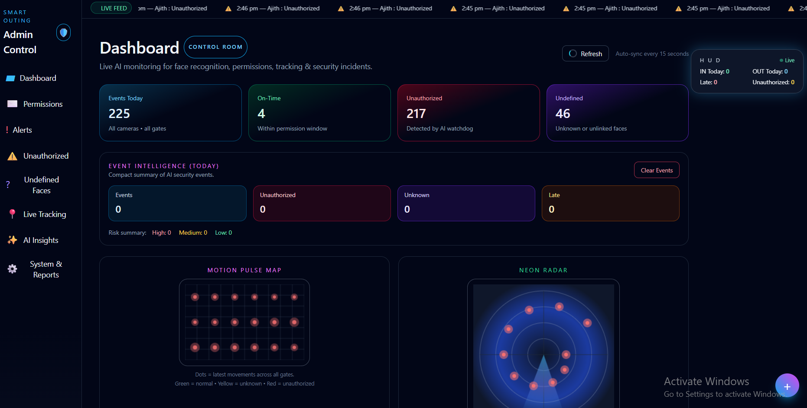
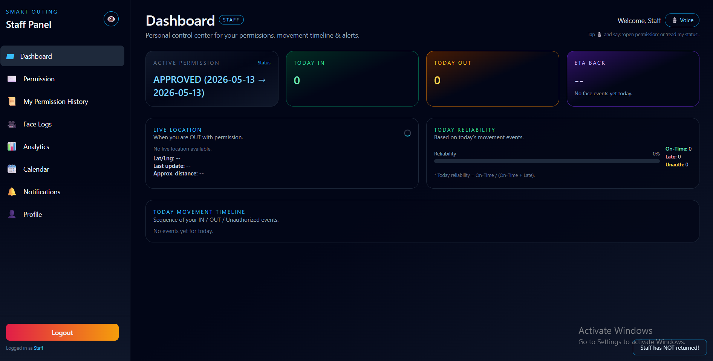
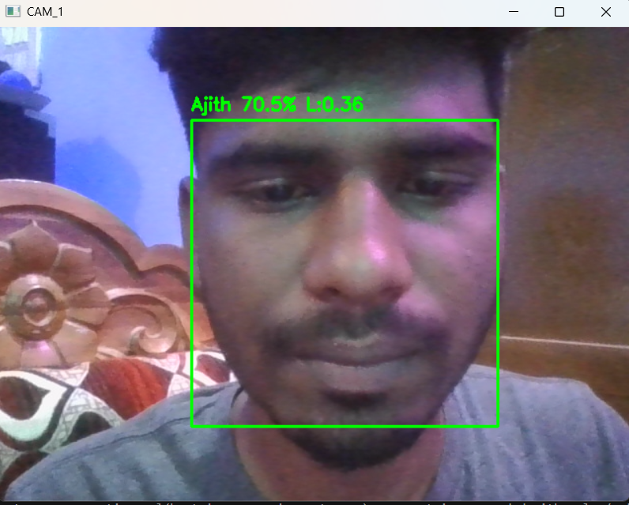

# 🎯 Face Analytics Attendance Management System

An intelligent attendance management system that uses **Face Recognition** to automate attendance tracking and provide real-time analytics.

## ✨ Features

* 👤 Face Detection & Recognition
* 📝 Automated Attendance Marking
* 🚪 Entry & Exit Monitoring
* 📊 Attendance Analytics Dashboard
* 🔥 Real-Time Event Tracking
* ☁️ Firebase Integration

## 🛠️ Tech Stack

* 🐍 Python
* 👁️ OpenCV
* 🤖 Face Recognition
* 🌐 Flask
* 🔥 Firebase
* 🎨 HTML & CSS

## 🚀 Getting Started

```bash
git clone <repository-url>
cd Face-Analytics-Attendance-Management-System
pip install -r requirements.txt
python app.py
```

## 📸 Preview





## 📈 Future Improvements

* 📧 Email Notifications
* 📄 Attendance Reports
* 📱 Mobile Application
* 📊 Advanced Analytics

## 👨‍💻 Developer

**Ajith**

Aspiring Python Backend Developer 🚀
